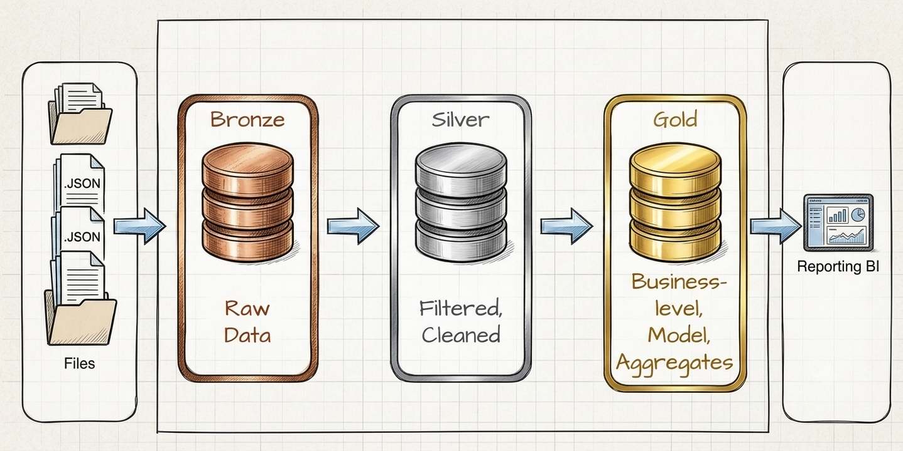

# Project_job

### Automatyczny pipeline danych zbierający codziennie oferty pracy z polskich portali IT, przetwarzający je przez trójwarstwową architekturę Medallion i dostarczający zagregowane statystyki rynku gotowe do analizy BI.

**Autor:** Bartłomiej Okoniewski · [github.com/poprostuokon](https://github.com/poprostuokon)

---

## Stack technologiczny

| Obszar | Technologia |
|---|---|
| Orchestracja | Apache Airflow 2.9 |
| Transformacje | dbt-core 1.7 + dbt-postgres |
| Baza danych | PostgreSQL 15 |
| Ingestion | Python 3.10 · Selenium 4 · undetected-chromedriver |
| Infrastruktura | Docker · Docker Compose |
| Raportowanie | ReportLab · openpyxl · SendGrid |
| Sterownik DB | psycopg2 |

---

## Architektura — Medallion



 Projekt implementuje trójwarstwową architekturę Medallion w PostgreSQL. Dane z portali IT trafiają codziennie do warstwy Bronze jako surowe pliki JSON — bez żadnych modyfikacji. Warstwa Silver normalizuje te dane do wspólnego modelu relacyjnego przez transformacje dbt — cztery różne struktury z czterech portali zostają sprowadzone do jednego spójnego schematu. Warstwa Gold buduje na tym model wymiarowy Dim/Fact z agregacjami dziennymi, miesięcznymi i rocznymi gotowymi pod analizę BI.

Głowne założenia wykorzystania Architektury Medallion dla tego projektu:

**Separacja surowych danych** — Bronze przechowuje dane 1:1 ze źródła. Portale mają różne struktury JSON — ta różnorodność jest zachowana w Bronze i ujednolicana dopiero w Silver, co oznacza że przy zmianie logiki transformacji nie trzeba ponownie pobierać ofert. Każda zmiana po stronie źródła: nowy portal, dodatkowe pole, inna struktura danych — dotyczy wyłącznie warstwy Bronze i modeli intermediate. Warstwy Silver i Gold pozostają nietknięte.

**Idempotentność na każdym poziomie** — loadery sprawdzają duplikaty po `offer_id` przed insertem, modele Silver używają strategii `delete+insert` per `offer_date`, modele Gold `delete+insert` per `d_date_id`. Każdą warstwę można bezpiecznie uruchomić wielokrotnie na tych samych danych bez efektów ubocznych.

**Optymalizacja wydajności** — kosztowne czyszczenie i normalizacja niejednorodnych formatów danych wykonywane są raz w Silver. Tabele Gold są partycjonowane po dacie i przechowują wstępnie zagregowane dane — dzięki czemu wyniki są gotowe i zmaterializowane. Zapytania BI trafiają bezpośrednio na gotowe struktury co przekłada się na przewidywalną i wysoką wydajność niezależnie od wolumenu danych historycznych.

| Warstwa | Schema | Odpowiedzialność |
|---|---|---|
| Bronze | `bronze.*` | Surowe dane 1:1 ze źródła, bez modyfikacji |
| Silver | `silver.*` | Czyszczenie, normalizacja, wspólny model relacyjny dla portali |
| Gold | `gold.*` | Model wymiarowy Dim/Fact, agregaty dzień/miesiąc/rok pod BI |

---

## Pipeline — przepływ dzienny

Pipeline orchestrowany przez Apache Airflow (`DAG: main_pipeline_praca_IT`, `schedule: 0 20 * * *`).
Airflow został wybrany ze względu na pełną kontrolę nad kolejnością i zależnościami między taskami,
natywną obsługę błędów przez `trigger_rule=ALL_DONE` oraz pełną historię każdego uruchomienia
zapisywaną w bazie. Błąd pojedynczego ptrocesu nie blokuje reszty — pipeline zawsze
kończy się wysyłką raportu email z podsumowaniem wykonania.

Transformacje Silver i Gold zarządzane przez dbt, który został wybrany ze względu na
modularność i łatwość utrzymania złożonej struktury transformacji. Każdy model ma
jedną odpowiedzialność i jawne zależności przez `{{ ref() }}`. Zmiana w modelu
źródłowym automatycznie propaguje się w dół grafu bez ręcznego śledzenia zależności.
Aliasy modeli Silver oddzielają nazwę pliku od nazwy tabeli w bazie, co upraszcza
refaktoryzację. Modele intermediate są ephemeral — nie tworzą obiektów w bazie,
są wbudowywane jako CTE bezpośrednio do modeli które je wywołują. Zmienna `FILE_DATE`
przekazywana przez Airflow pozwala każdemu modelowi operować na danych z konkretnego
dnia bez modyfikacji kodu. Jakość danych Silver weryfikowana jest przez dbt `singular tests` 
— failed test blokuje wgranie danych do Gold 
dla danego dnia.

Dodatkowo użycie Dockera pozwoliło na łatwe izolowanie całego środowiska pipeline'u —
Airflow, Selenium Grid i baza metadanych działają jako osobne kontenery z własną
konfiguracją, niezależne od systemu hosta. Przeniesienie projektu na nową maszynę
sprowadza się do jednej komendy `docker compose up`.

Szczegółowy opis kroków, trigger rules i systemu audytu: [docs/pipeline_flow.md](docs/pipeline_flow.md)

---

## Struktura repozytorium

```
project_job/
├── airflow_prod/    ← orchestracja i infrastruktura  (Docker Compose, Dockerfile, DAG, pluginy Airflow)
├── config/          ← zmienne środowiskowe
├── data/            ← raw JSON, archiwum, raporty
├── database/        ← skrypty DDL do migracji bazdy danych
├── loaders/         ← ładowanie plików JSON do warstwy Bronze
├── SCRAPER/         ← pobieranie ofert pracy ze stron internetowych (Selenium)
├── transform/       ← transformacje dbt (staging → intermediate → silver/gold)
├── requirements/    ← zależności Python per moduł (wykorzystywane biblioteki)
├── docs/            ← dokumentacja techniczna
└── SETUP.md         ← instrukcja instalacji na nowym środowisku
```

---

## Dokumentacja

| Plik | Opis |
|---|---|
| [docs/pipeline_flow.md](docs/pipeline_flow.md) | Szczegółowy opis wszystkich kroków pipeline'u, obsługi błędów i systemu audytu |
| [docs/data_catalog.md](docs/data_catalog.md) | Katalog wszystkich obiektów bazodanowych — tabele, widoki, procedury we wszystkich schematach |
| [docs/data_model_operational.md](docs/data_model_operational.md) | ERD modelu danych dla warstw Bronze, Silver i Maintenance |
| [docs/data_model_gold.md](docs/data_model_gold.md) | Star Schema warstwy Gold — wymiary, tabele faktów i decyzje projektowe |
| [docs/naming_conventions.md](docs/naming_conventions.md) | Konwencje nazewnicze obiektów bazodanowych |
| [docs/dbt_conventions.md](docs/dbt_conventions.md) | Konwencje nazewnicze modeli dbt, materialization i zmiennych |
| [SETUP.md](SETUP.md) | Instrukcja instalacji i migracji projektu na nowe środowisko |
