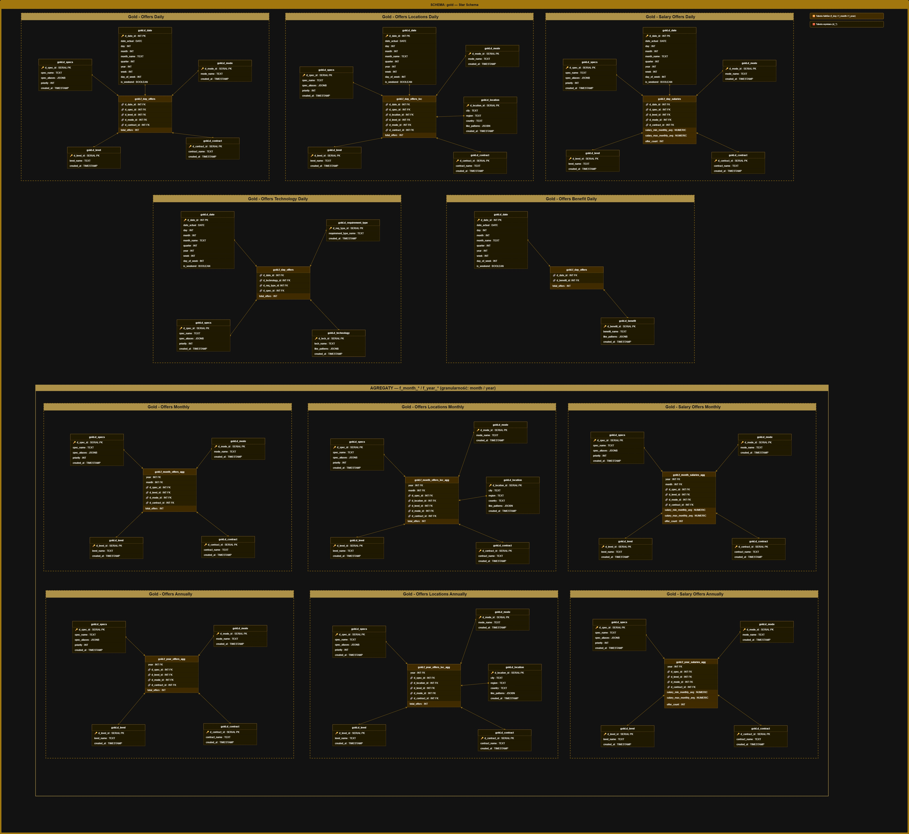

# Model danych — Gold (Star Schema)

Diagram przedstawia model wymiarowy warstwy Gold zbudowany w oparciu o architekturę Star Schema. Warstwa Gold dostarcza zagregowane dane analityczne gotowe pod narzędzia BI — podzielone na granularność dzienną, miesięczną i roczną.

---

## Diagram Star Schema

---

## Kluczowe decyzje projektowe

**Partycjonowanie** — tabele `f_day_offers` i `f_day_offers_loc` są partycjonowane po `d_date_id` per miesiąc. Partycje tworzone automatycznie przed każdym uruchomieniem Gold przez procedurę `maintenance.p_create_partitions_table_for_date`.

**Dopasowanie przez wzorce** — wymiary `d_technology`, `d_benefit` i `d_location` używają kolumny `like_patterns` (JSONB) zamiast sztywnych wartości. Pozwala to obsłużyć różnorodne nazewnictwo z czterech portali bez modyfikacji kodu transformacji.

**Brak klucza surogatowego w faktach** — tabele faktów nie mają własnego klucza głównego. Unikalność zapewniona przez kombinację kluczy obcych do wymiarów. Strategia ładowania `delete+insert` per `d_date_id` eliminuje potrzebę upsert.

**Agregaty z faktów dziennych** — tabele miesięczne i roczne agregują dane z tabel dziennych, nie bezpośrednio z Silver. Zapewnia to spójność danych na wszystkich poziomach granularności.

---

> Szczegółowy opis każdej tabeli i kolumny dostępny w [data_catalog.md](data_catalog.md).
> Konwencje nazewnicze obiektów w [database_conventions.md](database_conventions.md).
