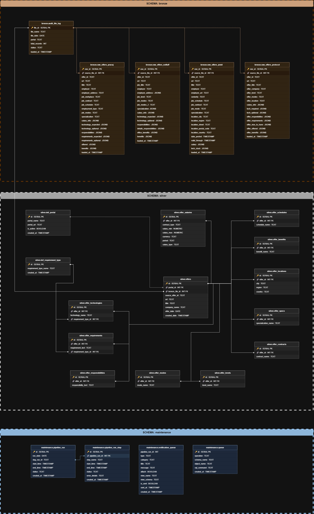

# Model danych — Operational (Bronze / Silver / Maintenance)

Diagram przedstawia model danych dla warstw operacyjnych projektu — Bronze, Silver i Maintenance. Pokazuje przepływ danych od surowych plików JSON przez znormalizowany model relacyjny Silver, aż po tabele audytowe pipeline'u.

---

## Diagram ERD

---

> Szczegółowy opis każdej tabeli i kolumny dostępny w [data_catalog.md](data_catalog.md).
> Konwencje nazewnicze obiektów w [database_conventions.md](database_conventions.md).
