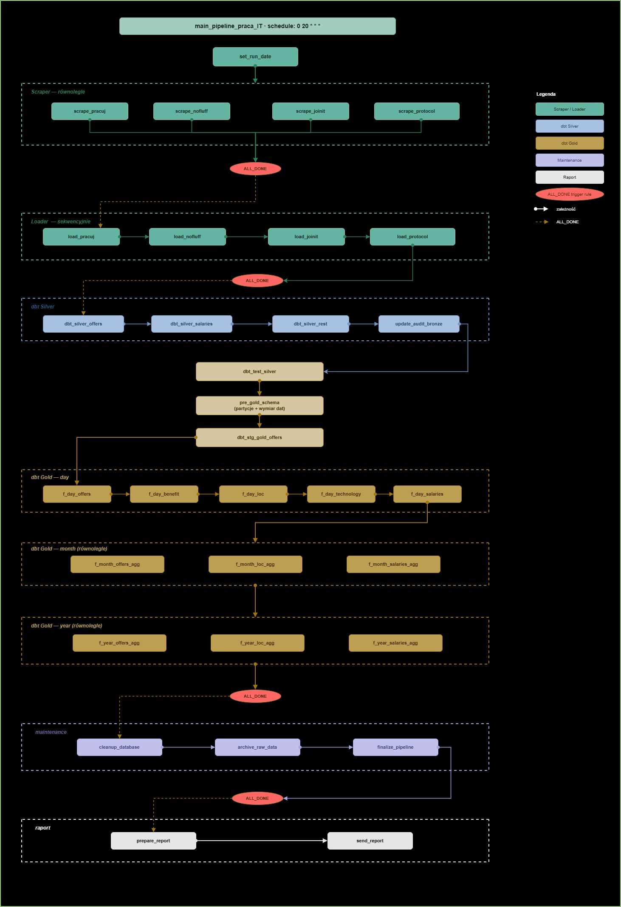

# Pipeline — Przepływ dzienny

Dokumentacja opisuje architekturę i kolejność wykonania codziennego pipeline'u danych orkiestrowanego przez Apache Airflow.

**DAG:** `main_pipeline_praca_IT`
**Schedule:** `0 20 * * *` — codziennie o 20:00
**Executor:** LocalExecutor (Docker)

---

## Diagram przepływu

---

## Legenda kolorów

| Kolor | Typ tasku |
|---|---|
| 🟢 Zielony | Scraper / Loader — ingestion danych |
| 🔵 Niebieski | dbt Silver — transformacje |
| 🟡 Złoty | dbt Gold — agregacje analityczne |
| 🟣 Granatowy | Maintenance — porządkowanie bazy |
| ⚪ Biały | Raport — generowanie i wysyłka |
| 🔴 ALL_DONE | Trigger rule — task uruchamia się zawsze niezależnie od statusu poprzedników |

---

## Kroki pipeline'u

### 1. set_run_date

Pierwszy task który zawsze się uruchamia. Pobiera aktualną datę i zapisuje ją do XCom jako `run_date` oraz `pipeline_run_id`. Tworzy rekord w tabeli `maintenance.pipeline_run` ze statusem `PENDING`. Wszystkie kolejne taski odczytują `run_date` z XCom — dzięki temu cały pipeline operuje na jednej spójnej dacie.

---

### 2. Scraper — równolegle

Cztery taski uruchamiają się jednocześnie, każdy dla osobnego portalu.

| Task | Portal |
|---|---|
| `scrape_pracuj` | pracuj.pl |
| `scrape_nofluff` | nofluffjobs.com |
| `scrape_joinit` | justjoin.it |
| `scrape_protocol` | theprotocol.it |

Każdy scraper uruchamiany przez `subprocess` — otwiera Chrome przez Selenium Grid, zbiera tylko nowe oferty z danego dnia i zapisuje wyniki jako plik JSON do `data/raw/YYYYMMDD/`. Błąd jednego scrapera nie zatrzymuje pozostałych — są od siebie niezależne.

Po zakończeniu wszystkich scraperów (niezależnie od ich statusu) trigger `ALL_DONE` przechodzi do loaderów.

---

### 3. Loader — sekwencyjnie

Cztery taski uruchamiają się jeden po drugim w ustalonej kolejności.

`load_pracuj` → `load_nofluff` → `load_joinit` → `load_protocol`

Każdy loader przed uruchomieniem sprawdza czy powiązany scraper zakończył się sukcesem. Jeśli scraper failed — loader loguje informację i kończy bez błędu (`SKIPPED`), nie przerywając reszty pipeline'u. Dla scraperów które zadziałały loader wykonuje deduplicację po `offer_id` i bulk insert do tabeli Bronze.

Po zakończeniu ostatniego loadera trigger `ALL_DONE` przechodzi do dbt Silver.

---

### 4. dbt Silver — sekwencyjnie

Cztery modele dbt uruchamiają się kolejno.

`dbt_silver_offers` → `dbt_silver_salaries` → `dbt_silver_rest` → `update_audit_bronze`

`dbt_silver_offers` uruchamiany z prefiksem `+` — uruchamia też wszystkie modele staging i intermediate od których zależy. Przetwarza dane z Bronze do znormalizowanego modelu relacyjnego Silver dla daty `FILE_DATE` pobranej z XCom.

`dbt_silver_rest` uruchamia wszystkie pozostałe modele Silver (technologie, benefity, lokalizacje, tryby pracy, poziomy, typy umów, wymagania, obowiązki, specjalizacje, harmonogramy).

`update_audit_bronze` aktualizuje tabelę `bronze.audit_file_log` — ustawia znacznik że dane z danego pliku JSON zostały pomyślnie przetworzone do Silver.

---

### 5. dbt_test_silver

Testy jakości danych Silver uruchamiane po zakończeniu transformacji Silver, przed wgraniem danych do Gold. Sprawdzają integralność strukturalną wszystkich 12 modeli Silver dla danych z bieżącego dnia (`FILE_DATE`).

Zakres testów:
- `not_null` — kluczowe kolumny nie mogą być puste
- `accepted_values` — znormalizowane pola (tryby pracy, poziomy stanowisk, typy umów, harmonogramy, waluty) muszą zawierać dozwolone wartości
- `relationships` — `offer_id` w tabelach szczegółowych musi istnieć w `silver.offers`

**Przy sukcesie** — pipeline przechodzi do `pre_gold_schema`.

**Przy failu** — task kończy się `ERROR`, wszystkie taski Gold dostają status `SKIPPED`. Generowany jest plik `error_dbt_test_silver_{date}.txt` z listą failed testów który trafia jako załącznik do raportu email. Dane Silver pozostają w bazie do ręcznej weryfikacji i ewentualnego ponownego uruchomienia Gold po poprawkach.

---

### 6. pre_gold_schema

Pojedynczy task wykonujący dwie procedury PostgreSQL przed uruchomieniem modeli Gold:

- `gold.load_d_date()` — sprawdza i w razie konieczności ładuje daty na następny rok do wymiaru `gold.d_date`
- `maintenance.p_create_partitions_table_for_date` — sprawdza i tworzy partycje na kolejny miesiac dla tabel `f_day_offers` i `f_day_offers_loc`

Musi się wykonać przed Gold bo tabele faktów są partycjonowane — bez partycji insert zakończyłby się błędem.

---

### 7. dbt_stg_gold_offers

Widok staging filtrujący dane Silver po `FILE_DATE`. Punkt wejścia dla wszystkich modeli faktów Gold. Uruchamiany jako osobny krok żeby wszystkie modele `f_day_*` miały gotowy widok przed startem.

---

### 8. dbt Gold — day (sekwencyjnie)

Pięć modeli faktów dziennych uruchamianych kolejno.

`f_day_offers` → `f_day_benefit` → `f_day_loc` → `f_day_technology` → `f_day_salaries`

Każdy model wczytuje dane z widoku `stg_gold_offers` i wymiarów Gold, agreguje per dzień i ładuje do partycjonowanej tabeli faktów. Strategia `delete+insert` per `d_date_id` — bezpieczne do ponownego uruchomienia.

---

### 9. dbt Gold — month (równolegle)

Trzy modele agregacji miesięcznych uruchamiają się jednocześnie po zakończeniu wszystkich `f_day_*`.

| Task | Źródło |
|---|---|
| `f_month_offers_agg` | agreguje z `f_day_offers` |
| `f_month_loc_agg` | agreguje z `f_day_offers_loc` |
| `f_month_salaries_agg` | agreguje z `f_day_salaries` |

---

### 10. dbt Gold — year (równolegle)

Trzy modele agregacji rocznych uruchamiają się jednocześnie po zakończeniu wszystkich `f_month_*`.

| Task | Źródło |
|---|---|
| `f_year_offers_agg` | agreguje z `f_month_offers_agg` |
| `f_year_loc_agg` | agreguje z `f_month_offers_loc_agg` |
| `f_year_salaries_agg` | agreguje z `f_month_salaries_agg` |

Po zakończeniu wszystkich modeli rocznych trigger `ALL_DONE` przechodzi do maintenance.

---

### 11. Maintenance — sekwencyjnie

Trzy taski porządkowe uruchamiają się kolejno.

`cleanup_database` → `archive_raw_data` → `finalize_pipeline`

**cleanup_database** — pobiera kolejkę zadań z `maintenance.queue` (wypełnioną przez procedurę `p_build_queue`) i wykonuje `VACUUM FULL` / `REINDEX INDEX` dla obiektów wymagających konserwacji. Błąd przy jednym obiekcie nie przerywa czyszczenia pozostałych.

**archive_raw_data** — przenosi folder `data/raw/YYYYMMDD/` do archiwum `data/archive/YYYY/MM/YYYYMMDD/`. Jeśli folder źródłowy nie istnieje (wszystkie scrapery failed) — pomija bez błędu.

**finalize_pipeline** — aktualizuje rekord `maintenance.pipeline_run` — ustawia `end_time` i status końcowy (`SUCCESS` / `PARTIAL_SUCCESS` / `ERROR`).

Po zakończeniu finalize trigger `ALL_DONE` przechodzi do raportu.

---

### 12. Raport

Dwa taski uruchamiające się sekwencyjnie — zawsze, niezależnie od statusu wcześniejszych kroków.

**prepare_report** — zbiera dane z bazy o wykonaniu pipeline'u, określa status (`SUCCESS` / `PARTIAL_SUCCESS` / `ERROR`), generuje pliki: PDF z podsumowaniem, Excel ze szczegółami kroków, Excel z ostrzeżeniami data quality (jeśli są), pliki txt z błędami scraperów (jeśli były). Zapisuje ścieżki plików do XCom.

**send_report** — odbiera ścieżki z XCom, buduje email z załącznikami i wysyła przez SendGrid. Temat emaila zawiera status i datę: `Pipeline praca IT [YYYY-MM-DD] - SUCCESS / PARTIAL SUCCESS / ERROR`.

---

## Obsługa błędów — resilience

Pipeline zaprojektowany tak żeby błąd w jednym miejscu nie blokował reszty:

- Scrapery są niezależne — błąd jednego nie zatrzymuje pozostałych
- Loadery sprawdzają stan scrapera i pomijają się bez błędu jeśli scraper failed
- Taski dbt, cleanup, archive, finalize i raport mają `trigger_rule=ALL_DONE` — uruchamiają się zawsze
- Status `PARTIAL_SUCCESS` gdy część scraperów failed ale nie wszystkie
- Status `ERROR` gdy błąd krytyczny poza scraperami lub wszystkie scrapery failed naraz

---

## System audytu

Każdy task ma podpięte cztery callbacki (`pre_execute`, `on_success_callback`, `on_failure_callback`, `on_skipped_callback`) zapisujące do tabel `maintenance.pipeline_run` i `maintenance.pipeline_run_step`. Po każdym uruchomieniu w bazie jest pełna historia — czas startu i końca, status i stack trace błędu dla każdego kroku.

---

## Zobacz też

- [data_catalog.md](data_catalog.md) — opis tabel Bronze, Silver, Gold i Maintenance
- [data_model_operational.md](data_model_operational.md) — ERD modelu operacyjnego
- [data_model_gold.md](data_model_gold.md) — Star Schema warstwy Gold
- [dbt_conventions.md](dbt_conventions.md) — konwencje modeli dbt
